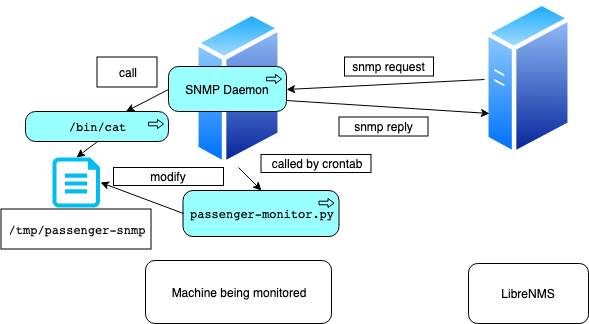

# Passenger Monitoring

# Illustration


# Requirements

* OS: Ubuntu 16.04
* check whether you can run `sudo passenger-status` because we will use this command in the following setup
```
sudo passenger-status
============================
Version : 5.0.27
Date    : 2019-06-26 11:57:23 +0800
Instance: H8ABx9be (Apache/2.4.18 (Ubuntu) Phusion_Passenger/5.0.27)

----------- General information -----------
Max pool size : 6
App groups    : 1
Processes     : 0
Requests in top-level queue : 0

----------- Application groups -----------
/var/canvas:
  App root: /var/canvas
  (spawning 1 new process...)
  Requests in queue: 1
```
* LibreNMS on branch php56
* Canvas application located at `/var/canvas` in the target machine

# Folder Structure
```
.
├── html
│   ├── includes
│   │   └── graphs
│   │       └── application
│   │           └── passenger_canvas_wait_list_size.inc.php (graphing functionality)
│   └── pages
│       └── device
│           └── apps
│               └── passenger.inc.php (after adding this php file, you will see Passenger application in the LibreNMS WebUI)
├── includes
│   └── polling
│       └── applications
│           └── passenger.inc.php
├── passenger-monitor.py (should be put in the target machine)
└── README.md
```

# Set up
The configuration breaks into two part: [the target machine part](#target) and [LibreNMS part](#librenms)

<a name="target" />

## The Target Machine Part
* Use crontab to set make `passegenr-monitor.py` run for every minute
```
sudo EDITOR=vim crontab -u root -e
# Add this line
* * * * * <this repo's folder in your target machine>/passenger-monitor.py
```
* Set `/etc/snmpd.conf` so that snmpd can `cat /tmp/passenger-snmp`
```
sudo vim /etc/snmpd.conf
# Add this line at the end of file
extend passenger /bin/cat /tmp/passenger-snmp
# Restart your snmpd
sudo systemctl restart snmpd
```

* Test whether your set up is correct
```
snmpwalk -c <your community string> localhost NET-SNMP-EXTEND-MIB::nsExtendOutput2Table | grep 'passenger'
snmpget -c <your community string> -Oqv localhost .1.3.6.1.4.1.8072.1.3.2.3.1.2.9.112.97.115.115.101.110.103.101.114
```
you should see a line showing the requests in the queue of `/var/canvas` application

* Have a glimpse on extended oid(Note that you should escape quotes to avoid interpretation by shell)
```
snmptranslate NET-SNMP-EXTEND-MIB::nsExtendOutLine.\"passenger\".1
```

<a name="librenms" />

## LibreNMS Part

* Put `includes/polling/applications/passenger.inc.php` into `~/includes/polling/applications/passenger.inc.php` in the LibreNMS machine

* Put `html/pages/device/apps/passenger.inc.php` into `~/html/pages/device/apps/passenger.inc.php` in the LibreNMS machine
* Put `html/includes/graphs/application/passenger_canvas_wait_list_size.inc.php` into `~/html/includes/graphs/application/passenger_canvas_wait_list_size.inc.php` in the LibreNMS machine 


# References
* https://blog.slowb.ro/monitor-passenger-applications-via-snmp/
* http://net-snmp.sourceforge.net/wiki/index.php/Tut:Extending_snmpd_using_shell_scripts
* http://net-snmp.sourceforge.net/tutorial/tutorial-5/commands/snmptranslate.html
* RRD Tutorial: https://oss.oetiker.ch/rrdtool/tut/rrdtutorial.en.html
* Troubleshooting poller process: https://docs.librenms.org/Support/Poller%20Support/
* Troubleshooting LibreNMS database: https://community.librenms.org/t/i-dont-have-permission-to-access-librenms-database-but-i-have-full-privlieges/4742/2
    * `vim ~/.env`: you can see the database password in this file
    * `mysql -h 127.0.0.1 -u librenms -p`: you can get into mysql shell by this command
        * Note: `localhost` in librenms is not defined, so using `localhost` alias will fail to connect to the database

# Comments
* I use `find . -name '*apache*'` to brute-force search which files are related to apache application and use these file as template to modify

